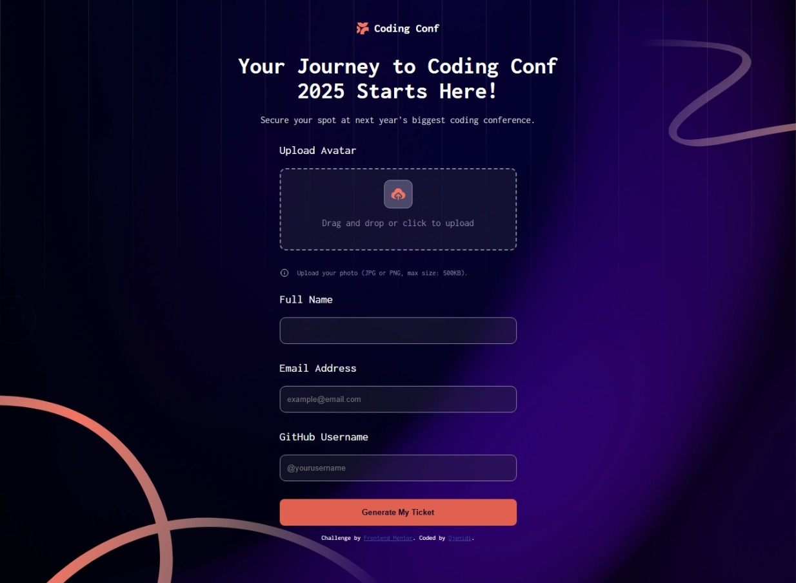
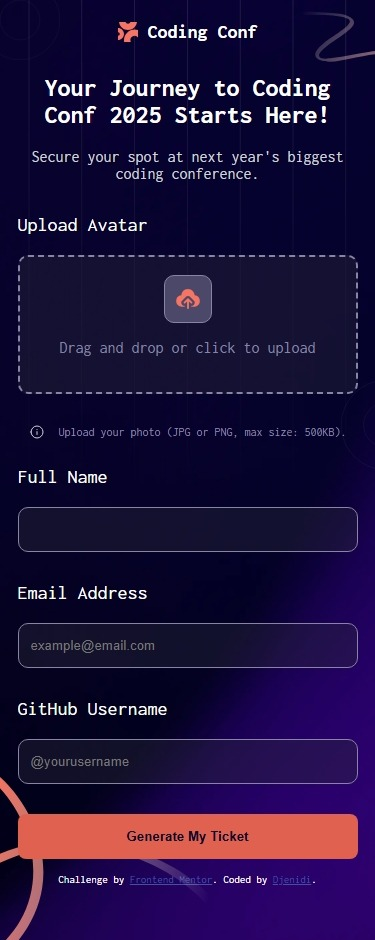

# Frontend Mentor - Conference ticket generator

## Welcome! 👋

Thanks for checking out this front-end coding challenge.

[Frontend Mentor](https://www.frontendmentor.io) challenges help you improve your coding skills by building realistic projects.

**To do this challenge, you need a basic understanding of HTML and CSS.**

## Table of contents

- [Overview](#overview)
  - [The challenge](#the-challenge)
  - [Screenshot](#screenshot)
  - [Links](#links)
- [My process](#my-process)
  - [Built with](#built-with)
  - [What I learned](#what-i-learned)
  - [Continued development](#continued-development)
  - [Useful resources](#useful-resources)
- [Author](#author)
- [Acknowledgments](#acknowledgments)

## The Challenge

## Screenshot

### Links

- Solution [here](https://github.com/djenidisimple/djenidisimple.github.io-conference-ticket-generator)
- Live Site [here](https://djenidisimple.github.io/djenidisimple.github.io-conference-ticket-generator/)

## Author
- Website - [Djenidi](https://github.com/djenidisimple)